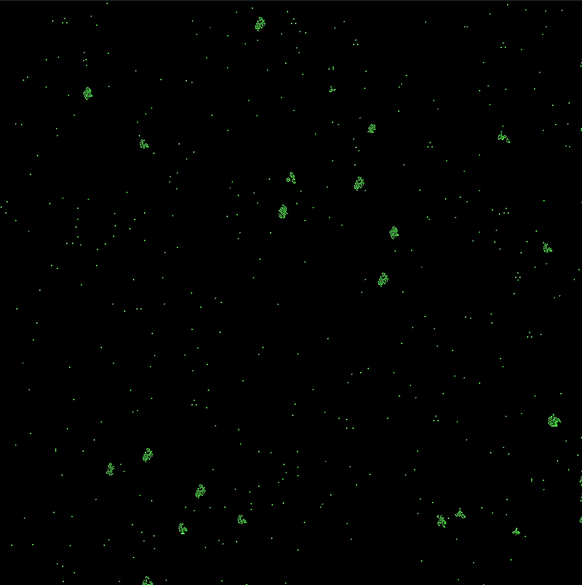

## Description
This repo contains two implementations of Conway's Game of Life, a cellular automaton.

The program starts off with a random initial configuration, partially determined by a variable to control dispersion.

The program proceeds deterministically from this initial state by the following rules:

1. Any live cell with two or three live neighbours survives
2. Any dead cell with three live neighbours becomes a live cell
3. All other live cells die in the next generation. Similarly, all other dead cells stay dead

## Game of Life Demo

